# Img2Coloring

This repository contains scripts, data and models for the Img2Coloring task - turning an RGB picture into a coloring book.

## Structure:
- *datasets/* 
Folder with datasets of this project

- *model/* 
Folder with saved weights of trained GAN Pix2Pix model on anime data and Img2LineDrawings. To get trained models also visit this Kaggle dataset: https://www.kaggle.com/datasets/kerrit/img2coloring-pix2pix-trained-models

- *ColoringBook_filters_and_Style_Transer.ipynb* 
Scripts for task with convolutional filters, and style transfer for Img2Coloring

- *Multicue_dataset_preprocessing.ipynb* 
Scripts to complete multicue dataset in better common format, with merged lines from different annotators.

- *pix2pix_GAN_Training.ipynb* 
Script to train pix2pix model for Img2Coloring task. Already trained models (from 12 and 20 epoch) can be loaded from *models/* folder.

- *Transform_images_with_InstructPix2Pix_and_Img2Drawings.ipynb* 
Scripts to transform local images in "slonik" (kids) style with already pretrained models.

## Datasets
- Multicue dataset 
https://serre-lab.clps.brown.edu/resource/multicue/

This dataset is realistic photo dataset with edges maps from different annotators. This edges not strict, so in this scripts multicue dataset was preprocessed to merge edges for same photos between annotators (in Multicue_dataset_preprocessing.ipynb). Final result - dataset "border_dataset.zip" in "datasets" folder.  

Typical image and merged borders from this dataset:
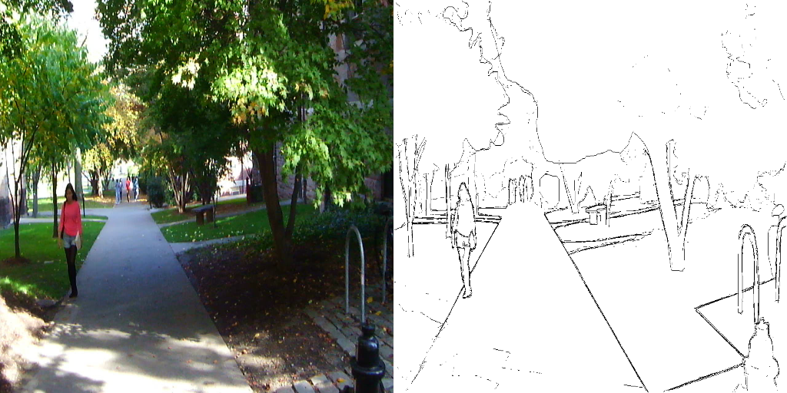
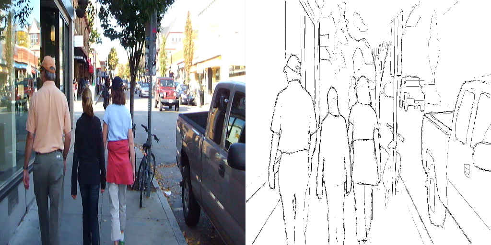

- BIPED dataset 
https://www.kaggle.com/datasets/xavysp/biped

Dataset with realistic photos with edges, annotations for this photos is bad for Img2Coloring task, but can be helpfull in other cases.

- AbsKids datasets  
*datasets/AbsKidsImg2Line.zip* 
*datasets/AbsKidsTextImg2Line.zip* 
*datasets/AbsKidsOtherImg2Line.zip* 

Inner dataset with images in kids style with RGB format. These images was target images for Img2Coloring task.

- Anime Sketch Colorization Pair 
https://www.kaggle.com/datasets/ktaebum/anime-sketch-colorization-pair

Dataset for anime sketches colorizations. In this projects it can be used in reverse task, to uncolorize (make a coloring book style, in some interpretation) source anime images.

## Samples

This is samples for different approaches for Img2Coloring task.

### Filters
Default convolutional filters for edge detections.  
Canny filter
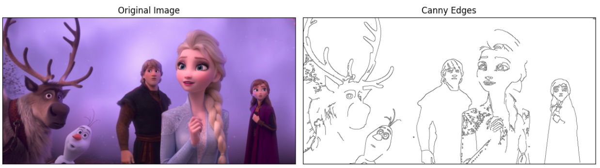
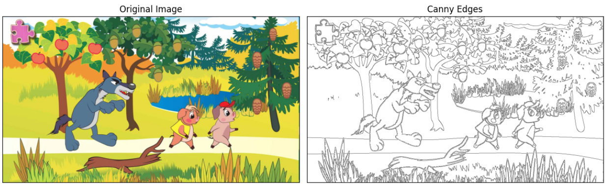
 
Sobel filter
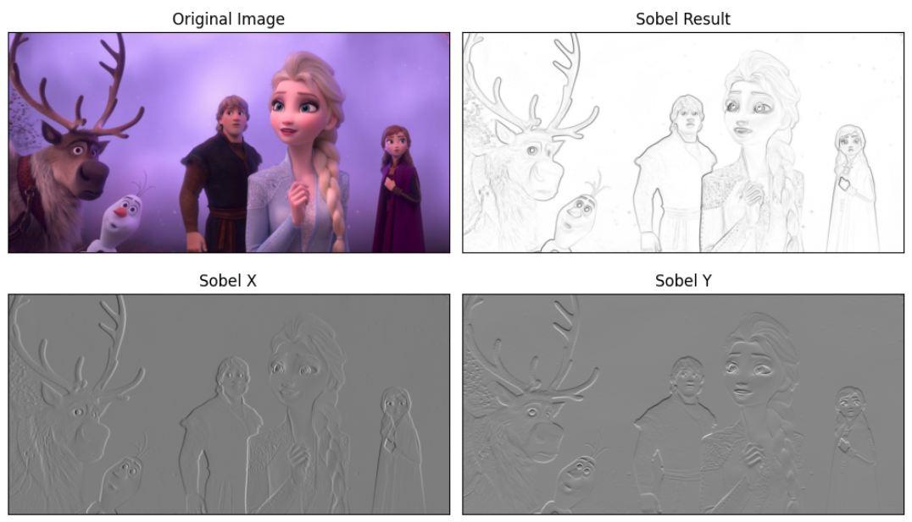
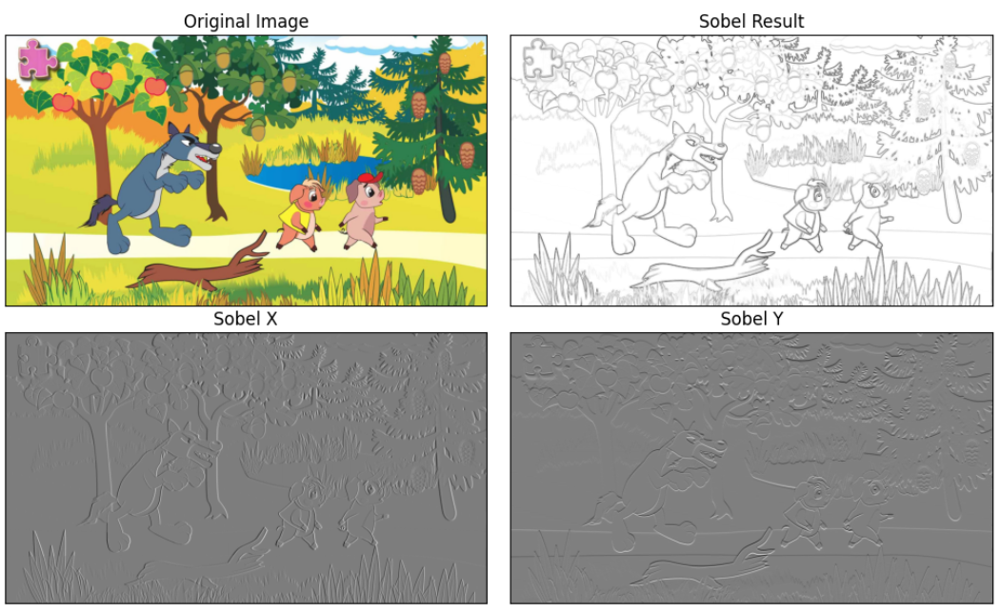

### Pretrained models
Results for pretrained "Img2LineDrawings" model:
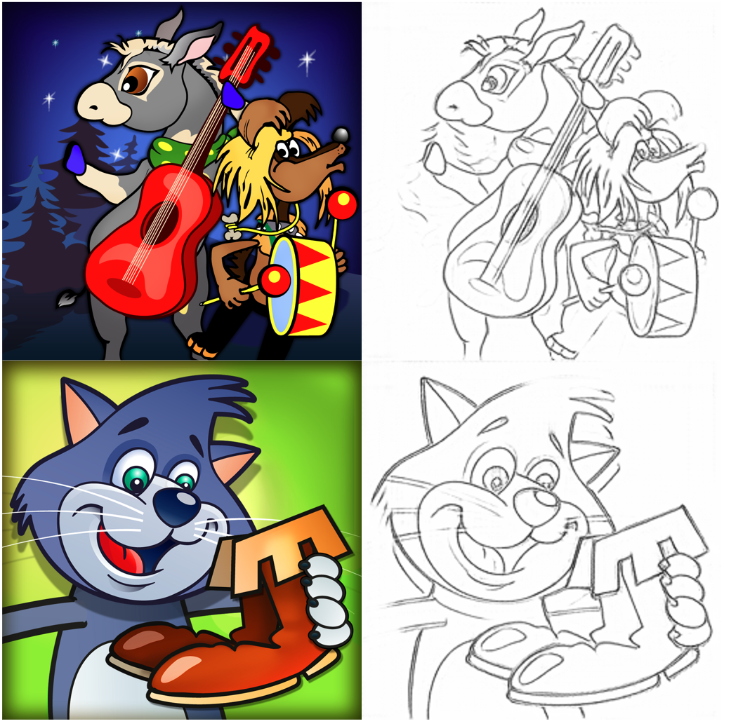
Results for pretrained "ControlNet" model:
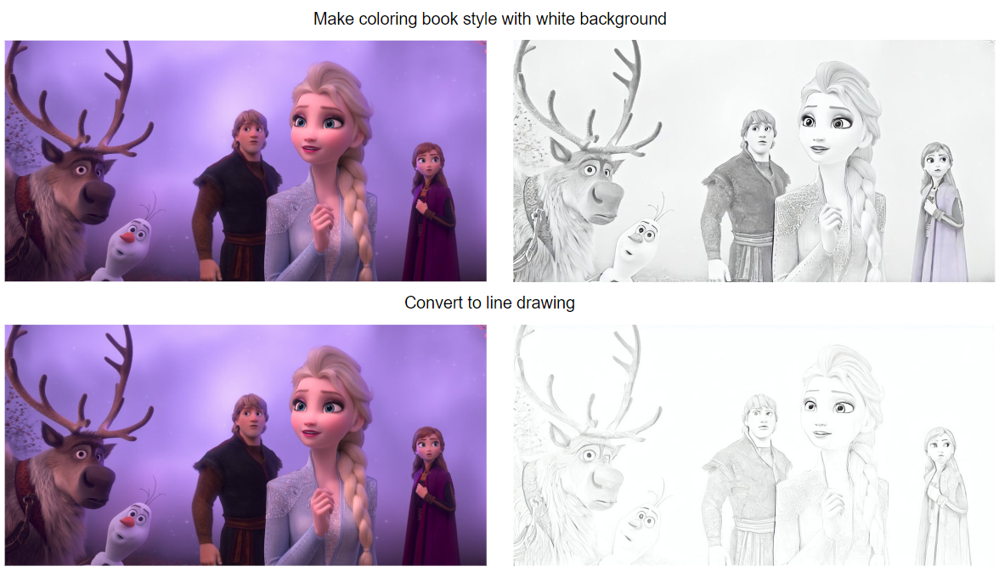

### Trained own Pix2Pix model
Results for anime and kids images for own Pix2Pix model (from epoch 12).  
Anime images samples:
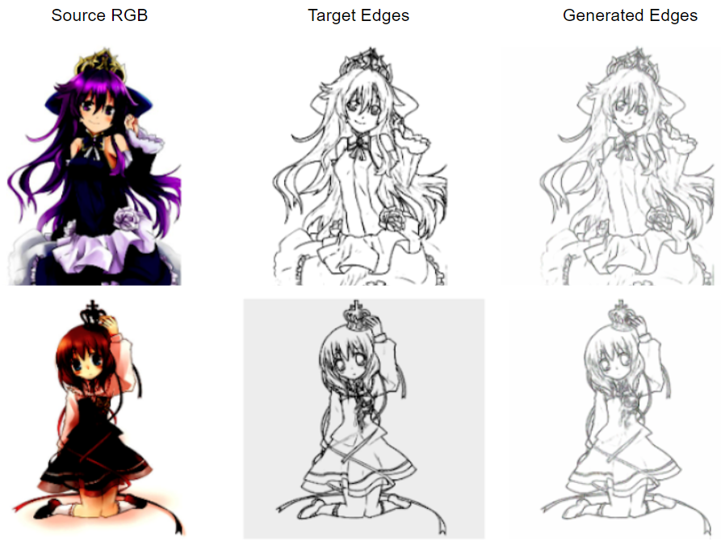
Kids images samples:
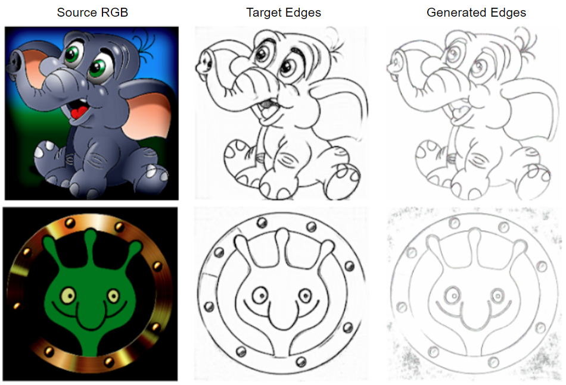
Kids images 2 samples:
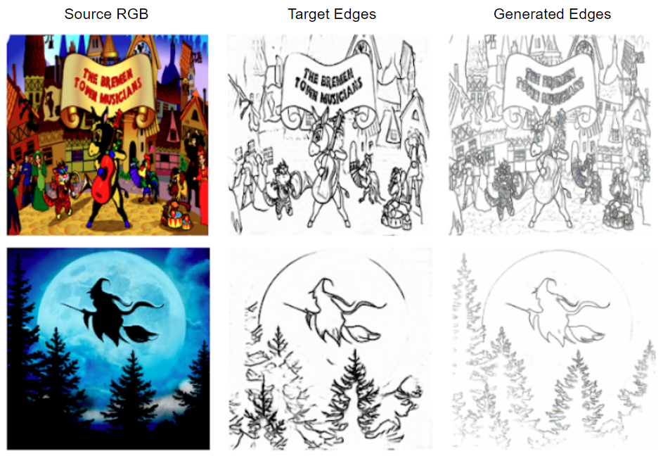

